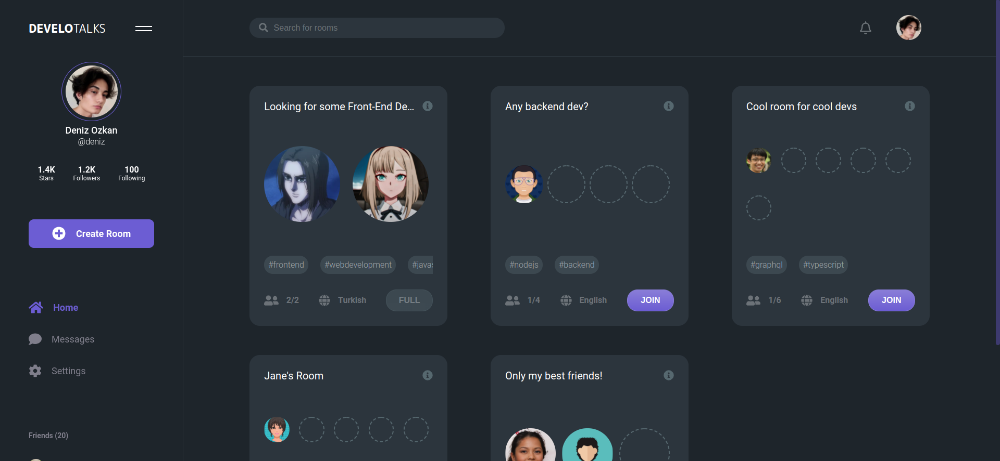

# DeveloTalks

| This project is currently a work in progress. Keep in mind that you are likely to encounter features that do not work exactly as expected while using it. |
| :-------------------------------------------------------------------------------------------------------------------------------------------------------------------------------------------------------------------------------------------------------------------------------------------------------------------------------------------- |

## Introduction

`DeveloTalks` is a social platform aiming to be the #1 developer meeting center. You can start new conversations by creating a new room, or you can join an existing room with a topic that interests you.

Chatting with `voice`, `video`, or `text`! You can find developers to talk to from all around the world, at any time of the day!

Using DeveloTalks,

- You can **expand your networks**,
- You can **share your screen and solve your technical problems with people**,
- You can **talk about a new technology**,
- You can **talk in your native language** or **practice your English with others**,
- You can **get career advice** or you can **share your experiences with others**,
- You can **get prepared with mock interviews**,

and more!




## Installation & Running in Development

> Make sure you have **Node.js** installed on your system.

### Backend

1 - Open your terminal and navigate to the `backend` folder

```bash
$ cd backend
```

2 - Install dependencies via npm

```bash
$ npm install
```

3 - Run the backend in development by using the following command

```bash
$ npm run watch
```

### Frontend

1 - Open your terminal and navigate to the `frontend` folder

```bash
$ cd frontend
```

2 - Install dependencies via npm

```bash
$ npm install
```

3 - Run the frontend in development by using the following command

```bash
$ npm run serve
```

After that, you should be able to see the app at [http://localhost:8080](http://localhost:8080) in your browser.

## Tests

### Backend

1 - Open your terminal and navigate to the `backend` folder

```bash
$ cd backend
```

2 - Run the tests by using the following command

```bash
$ npm run test
```

## Screenshots

### DeveloTalks homepage


### The homepage after user login


### The modal for creating a new room


### The redirected page after automatically joining the created room


### The button on the top of the page that the user can use to return to the room they are connected to


### The homepage displayed by a second user


### The homepage that the second user sees after logging in


### User profile page


### Second user joining the room


### The room from the first user side (with screen sharing on and mic off)


### The room from the second user side (with camera and mic on)


### Disabled join button when the room capacity is full


### The room after the first user leaves


### Empty participant area on the room card after the user leaves


### Settings page for updating the profile


## License
MIT License

Copyright (c) 2020 Deniz Ozkan

Permission is hereby granted, free of charge, to any person obtaining a copy
of this software and associated documentation files (the "Software"), to deal
in the Software without restriction, including without limitation the rights
to use, copy, modify, merge, publish, distribute, sublicense, and/or sell
copies of the Software, and to permit persons to whom the Software is
furnished to do so, subject to the following conditions:

The above copyright notice and this permission notice shall be included in all
copies or substantial portions of the Software.

THE SOFTWARE IS PROVIDED "AS IS", WITHOUT WARRANTY OF ANY KIND, EXPRESS OR
IMPLIED, INCLUDING BUT NOT LIMITED TO THE WARRANTIES OF MERCHANTABILITY,
FITNESS FOR A PARTICULAR PURPOSE AND NONINFRINGEMENT. IN NO EVENT SHALL THE
AUTHORS OR COPYRIGHT HOLDERS BE LIABLE FOR ANY CLAIM, DAMAGES OR OTHER
LIABILITY, WHETHER IN AN ACTION OF CONTRACT, TORT OR OTHERWISE, ARISING FROM,
OUT OF OR IN CONNECTION WITH THE SOFTWARE OR THE USE OR OTHER DEALINGS IN THE
SOFTWARE.
